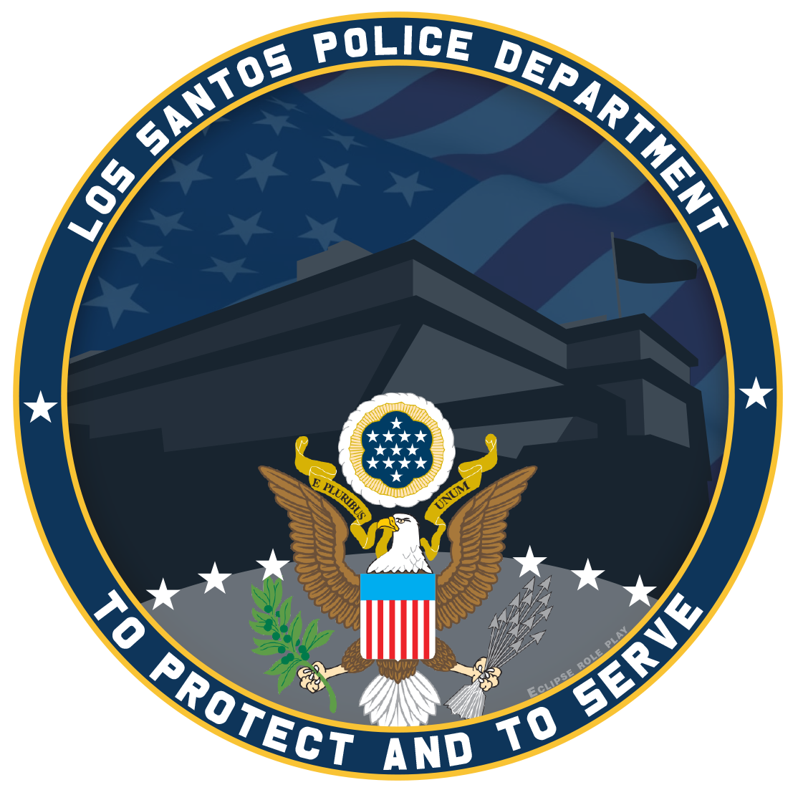

# 🚨 Police SOP

<figure><figcaption>
<mark style="color:orange;"><strong>Los Santos Police Department</strong></mark>
</figcaption></figure>


This information will be changed and updated regularly. Please Stay up-to-date


This document provides information and procedures regarding the PD. It shall be the duty and responsibility of all personnel and employees of the PD to familiarize themselves with all policies outlined within this handbook, the training materials in accordance with City Of Los Santos. Unless explicitly stated, these operations and procedures are to be followed during all patrols. Ignorance or misinterpretation of any manuals or other provisions will not be accepted as a defense against disciplinary changes. For questions or interpretation, contact a ranking member.
