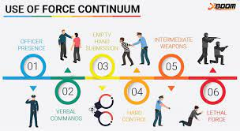
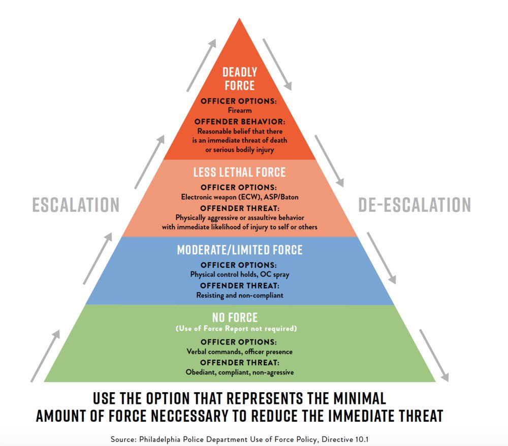

# 🚫 Use Of Force Policy


We take our Use of Force Policy very seriously and any officer who abuses this policy will be permanently removed from Law Enforcement. Take this serious.


> <mark style="color:red;">**(a)**</mark> Deadly force means that force which a reasonable person would consider likely to cause death or serious bodily harm. Its use may be justified only under conditions of extreme necessity when all lesser means have failed or cannot reasonably be employed. A protective force deputy is authorized to use deadly force only when one or more of the following circumstances exist:
>
> \
> <mark style="color:red;">**(1)**</mark> `Self-Defense.` When deadly force reasonably appears to be necessary to protect a protective force deputy who reasonably believes himself or herself to be in imminent danger of death or serious bodily harm.
>
> <mark style="color:red;">**(2)**</mark>** ** `Serious Offenses Against Humans.` When deadly force reasonably appears to be necessary to prevent the commission of a serious offense against a person(s) in circumstances presenting an imminent danger of death or serious bodily harm (e.g. sabotage of an occupied facility by explosives).
>
> <mark style="color:red;">**(3)**</mark>** ** `Apprehension.` When deadly force reasonably appears to be necessary to apprehend or prevent the escape of a person reasonably believed to: (i) have committed an offense of the nature specified in paragraphs (a)(1) through (a)(4) 1 of this section; or (ii) be escaping by use of a weapon or explosive or who otherwise indicates that he or she poses a significant threat of death or serious bodily harm to the protective force deputy or others unless apprehended without delay.
>
> <mark style="color:red;">**(b)**</mark>** ** `Additional Considerations Involving Firearms.` If it becomes necessary to use a firearm, the following precautions shall be observed:
>
> <mark style="color:red;">**(1)**</mark> A warning, e.g. an order to halt, shall be given, if feasible before a shot is fired.
>
> <mark style="color:red;">**(2)**</mark> Warning shots shall not be fired.


**Department Policy:** (Must READ)


> When an Officer engages with a member of the public, the Officer will do so in such a manner that shows the person respect and dignity. The use of excessive force or unwarranted physical attention or unprofessional contact by Officer will not be tolerated under any circumstances. All Officers must adhere to the provisions of moral and ethical norms to provide unbiased services to the community.


**Use of Force Continuum:** (Must READ)


<figure><figcaption></figcaption></figure>

<figure><figcaption></figcaption></figure>

> The use of force outlined in this policy is to be followed by all Officers. Below you will find the Use of Force Continuum:
>
> * Officers Presence
> * Verbalization (Verbal commands provided to the individual.)
> * Empty Hand Control (hand to hand combat.)
> * Less Lethal
>   * Taser.
>   * Chemical Gas.
>   * Blunt Impact. (Baton / Flashlight)

> * Lethal (Deadly) Force.
>   * Firearms.


**Deadly Force:** (Must Read)

Deadly force is the use of any force that is likely to cause death or serious physical injury. When a Officer uses such force, it may only be used in accordance with this policy.

`Use of Deadly Force (Below)`


> Probable cause must be established prior to exercising deadly force. The reasonableness of decision must be viewed from the perspective of the deputy on the scene, who may often be forced to make split-second decisions in circumstances that are tense, unpredictable, and rapidly evolving. Reasonableness is NOT to be viewed from a calm vantage point. The LSPD recognizes that protection of life and property is its paramount mission. Consistent with this value, the LSPD will take all reasonable steps to prevent the need to use deadly force; yet, even with the best prevention tactics in place, Officers may be confronted with a situation that threatens his or her life, or the lives of those around him or her. As such, the use of deadly force may NEVER be used upon only a mere suspicion of a crime and can only be sued when lesser force would not defuse the situation - Officers will and must fire upon an imminent threat to serious physical injury or life.
>
> Officers may only use deadly force to prevent the escape of a fleeing Subject if there is probable cause to believe that the escapee would cause an imminent danger or death to another person. Clarified, if a person just committed murder and is fleeing, and there is no evidence to support that the suspect will commit an additional murder, deadly force may not be used.
>
> Prior to using deadly force, if feasible, Officers will audibly command the subject to submit to their authority.
>
> Warning shots are not authorized under any circumstances. Discharge of a firearm is only permissible under the circumstances when deadly force must be used - only to prevent a loss of life. Shooting to wound or disarm someone is an unrealistic standard, as such, it is strongly discouraged.
>
> Shooting to disable a moving motor vehicle is FORBIDDEN. Firing to disable a motor vehicle can only take place when the vehicle is stationary/ Firing into the passenger cabin of a motor vehicle is forbidden while a vehicle is in motion as deputies risk a crash or ricochet.


**After Action Clearance:** (Must Read)


> Whenever an Officer discharges his firearm, he or she must request the presence of his or her immediate supervisor to clear him or her from the scene. If the Officer's supervisor was involved in the discharge of a firearm, the next highest-ranking member must attend the scene. A Officer cannot clear him or herself from shots fired. Supervisors and detectives must determine if the use and amount of force were warranted and just based on the severity of the crime, whether or not the Subject posed an immediate threat to life, and whether or not the Subject actively resisted arrest.
>
> <mark style="color:green;">Failure to follow the Use of Force Policy during a situation which results in injury, death or damage to others may lead to suspension, demotion, termination or legal charges being filed.</mark>


**Field Interrogations:** (Must Read)


> <mark style="color:green;">Field interrogations are considered to be any contact with the public, Subjects, or witnesses for the purpose of official questioning pertaining to any violation of the civil or criminal code of the Liberty Revised Statutes. Field interrogations can be defined as "questioning without an arrest in the field." Prior to conducting a field interrogation, the Officer MUST identify himself; unless the Officer is participating in an undercover operation.</mark>
